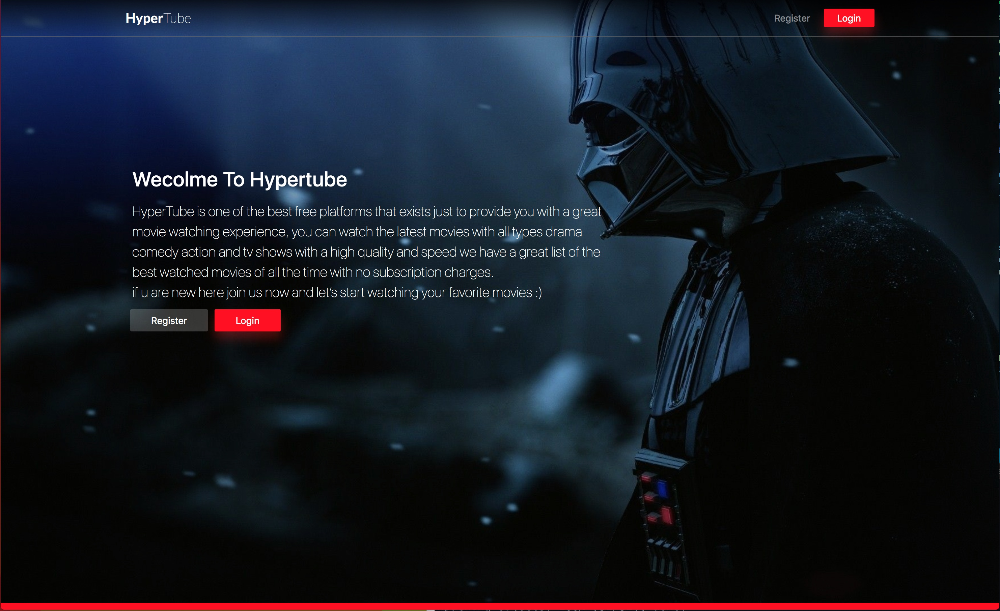
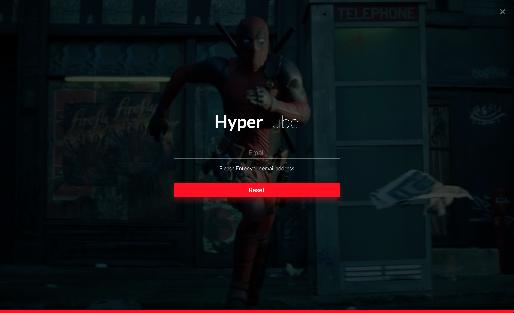
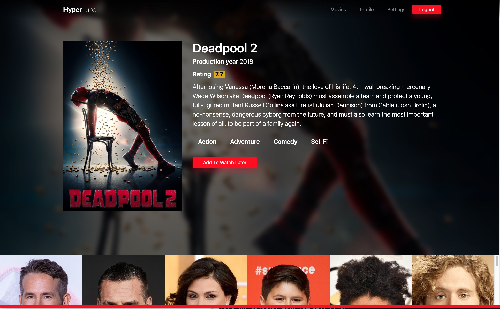
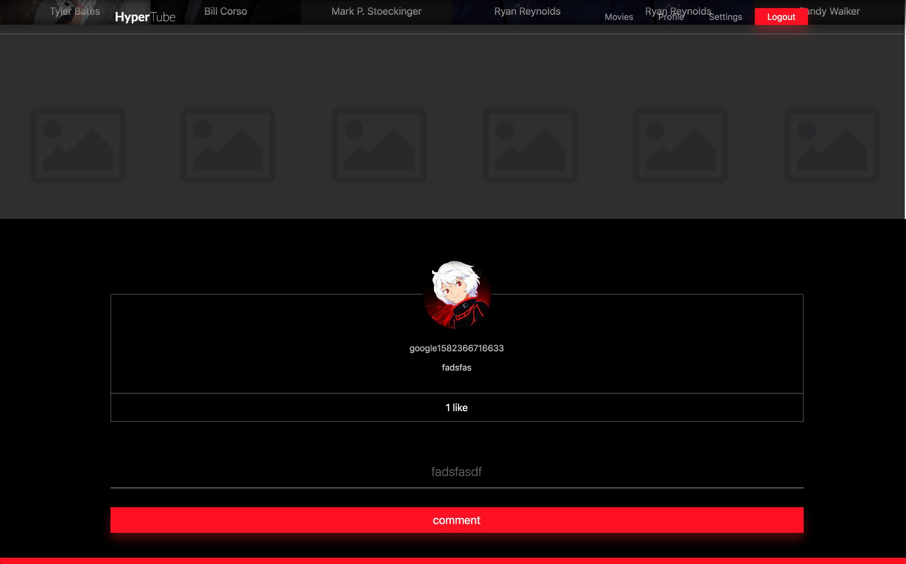

# HyperTube 🎬

A Streaming Web Application that allows users to research and watch videos downloaded via the BitTorrent protocol.

## 👉 Description 

The application allows a user to register asking for an email address, a username, Last name, first name and password or via Omniauth.
Then the user able to connect with his/her username and password and he/she Able to receive and email allowing him/her to re-initialize his/her password should the first one be forgotten. 
The user able to select a preferred language (English or french) and also modify the Email address profile picture and information. 
The user is able to consult other users profile.
The library page contains a research field and a thumbnails list for the movies. When a user make a research the search engine interrogate with multiple torrent Source provider and returns the list of movies founded. And it’s sortable and filtered by genre, IMDB Grade .. The movie details contains the details of the movies fetched from the movie db Api as well the list of torrents available for that movie When a user clicks in a torrent to play if the file wasn't downloaded in the server Before it’s will be downloaded from the associated torrent and stream the video Flux from that one as soon as enough data has been downloaded to ensure a Seamless watching of the video, and if the video is not natively readable for the browser it will be converted on the fly in an acceptable format Once the movie is entirely downloaded, it’s saved on the server, so that we don’t need to re-download the movie again. And if a movie is unwatched for a month, it will be Erased. Also the subtitles available for the movie is downloaded. And user can comment on the video and vote comments of each other.

## ⚙️ Used Technologies
💅 FrontEnd   : REACT, SASS

🛠 Backend    : NodeJs (express)

💾 Database   : MongoDB

☁️ Deployment : Docker, Github

## 📸 App Screenshots

### ▪️ login Page 

### ▪️ Signup Page

### ▪️ Reset Password Page

### ▪️ Home Page

### ▪️ Search Page

### ▪️ Movie infos Page

### ▪️ Video Player 

### ▪️ Subtitles

### ▪️ Comments 

### ▪️ Settings Page 

### ▪️ Public Profile Page 

## Backend API Description

##### Routes Description

➡️ FOR HOME PAGE 

GET REQUEST

| End point     | Description                     |
| ------------- |:--------------------------------: 
| /api/movies   | Used to list out all the available movies and return thumbnails info sorted by seeds|

Endpoint Parameters

| Parameter  | Type     | Description                     |
| ------------- |---|:--------------------------------: |
| page    | Integer (Unsigned)	  |Used to see the next page of movies|
| lang    | "ar" "fr" "en" default is "en"	  |Used to set the language of the response|
| sort    | string(title or year or seeds or rating or date_added)	  |Sorts the results by choosen value|
| genre    | string	  |Used to filter by a given genre (See http://www.imdb.com/genre/ for full list)|

➡️ FOR SEARCH

GET REQUEST

| End point     | Description                     |
| ------------- |:--------------------------------: 
| /api/search   | Used to list out all the available movies for the name and return thumbnails sorted by names|

Endpoint Parameters

| Parameter  | Type     | Description                     |
| ------------- |---|:--------------------------------: |
| title    | string  |movie name|
| page    | Integer (Unsigned)	  |Used to see the next page of movies|
| lang    | "ar" "fr" "en" default is "en"	  |Used to set the language of the response|

➡️ FOR Movie info

GET REQUEST

| End point     | Description                     |
| ------------- |:--------------------------------: 
| /api/movieInfos   | Used to list out all the available infos for a movie and torrents|

Endpoint Parameters

| Parameter  | Type     | Description                     |
| ------------- |---|:--------------------------------: |
| imdb    | string  |movie imdb code|
| lang    | "ar" "fr" "en" default is "en"	  |Used to set the language of the response|

➡️ FOR Movie Streaming

GET REQUEST

| End point     | Description                     |
| ------------- |:--------------------------------: 
| /api/streamvideo   | Used to stream a video passing torrent hash you need to add is a source in video player|

Endpoint Parameters

| Parameter  | Type     | Description                     |
| ------------- |---|:--------------------------------: |
| hash    | string  |torrent hash|

#### Comment Section

➡️ Add new comment 

| End point | Method | Params | Type | Description |
|-----------|--------|------|--------|:-----------:|
| /api/comments | POST | movieId commentBody | Object | Insert new comment to a given movie -movieId : the movie where the comment is belong to -commentBody : the comment content|

➡️ Get movie comments 

| End point | method | Params | Type | Description |
|-----------|--------|--------|------|:-----------:|
| /api/comments | GET | movieId | mongo ObjectId | Fetch all the comments fot a give movie |

➡️ Vote for a comment

| End point | method | Params | Type | Description |
|-----------|--------|--------|------|:-----------:|
| /api/comments/vote | POST | CommentId | String | vote for a given comment |

#### Subtitles Section

➡️ Search and download movie subtitles

| End point | Method | Params | Type | Description |
|-----------|--------|------|--------|:-----------:|
| /api/subtitles/search | GET | imdbid | string | Search for subtitles to a given movie and serve an object with the avialable subtitles with thier path on the server to be downloaded |

➡️ Download Subtitles

| End point | method | Query | Type | Description |
|-----------|--------|--------|------|:-----------:|
| /api/subtitles/search| GET | path | string | Serve the subtitle file if it exist |

Made with ❤️ @ 1337 School